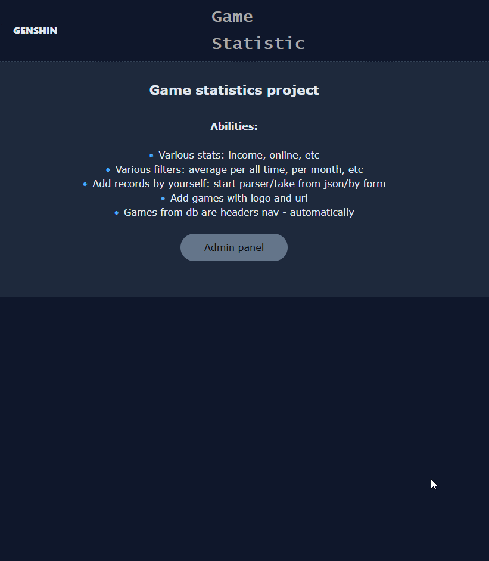
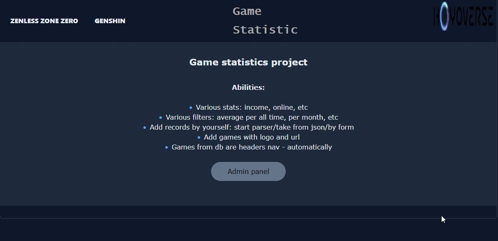

📝 Games statistics project

## 🧩 Description

A mini-site for loading, parsing and analyzing game metrics.

Project abilities:
- load data from JSON-files;

- start parser to collect data from external sources;

- add records manually via form;

- analyzing stats(online, income, etc);

- filter stat by date;

- nav render by games from db.

The system is built as internal analytical tool with a centralized entry point via index.php (URL routing + redirection).

## 🖋 Features

- Multiple statistics types (online, income, etc.)

- Date range filtering (including single-month mode)

- Average calculations (all time / per month)

- JSON raw file import into database

- Parser integration for external data sources

- Manual record creation via form

- Dynamic game navigation generated from database

- Custom HTML error handler (html_error())

- Centralized routing via index.php (redirect-based entry point)

- Modular project structure (core / models / views logic separation)

## ⚙️ Technologies

* PHP (procedural + structured architecture)

* MySQL (PDO for secure database interaction)

* JavaScript (ES6) — dynamic UI rendering

* HTML5 & CSS3 — custom admin interface

* Apache rewrite / routing via index.php

* Sessions — admin access handling

* JSON parsing — data import & processing

🧱 Architecture Highlights

* Single Entry Point Pattern — all requests pass via index.php

* Custom lightweight routing logic

* Separation of responsibilities (data loading / parsing / rendering)

* Centralized error output via html_error() function

* Dynamic UI rendering via JavaScript (SPA-like behavior for main sections)

Project is done without any frameworks. Logic is done manually to demonstrate understanding backend-logic.

## 🗄 Database

The module requires a MySQL database with the following main tables:

- games - games list(using as header navigation + url forming);

- g_online — include id_game, date, online, source;

- g_income — include id_game, date, income, source.

Database dumps and structure can be found in:

📁 /sql/

To import it:
- mysql -u root -p articles < sql/sql.sql

Don't forget to change db credentials in: /core/db.php

## 📸 Demonstration

## 📸 Screenshots
- Additional screenshots can find in same folder: /screenshots/

## ⚙️ Running the Module(!)

1. Launch your local server (Apache/Nginx with PHP support or OSPanel).

2. Import the provided database dump (sql.sql).

3. Configure your database credentials inside core/db.php.
   
4. Make sure URL rewriting is enabled (Apache mod_rewrite).

5. Open your browser at your local host address (e.g., http://localhost/game-stats/).

Admin panel is simple. Session is created for 24h. To login use username: "admin" and password: "1212" - without "". To change go to: /api/admin/login.php 

- ⚠️ The application uses centralized routing via index.php.
All requests must go through the web server.
Opening PHP files directly from the filesystem will not work.

## 🎯 Purpose of the Project

This project was built to:

- practice backend architecture without frameworks;

- implement custom routing logic;

- work with structured database design;

- build an internal admin analytics tool;

- prepare for transition to Laravel framework.

## 🔜 Next Step

The next stage of development is rebuilding similar logic using Laravel,
applying:

- MVC architecture

- Blade templating

- Eloquent ORM

- Built-in routing system

- Proper validation & request handling
